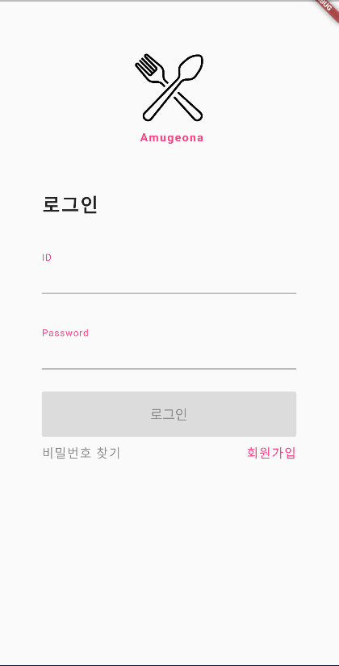
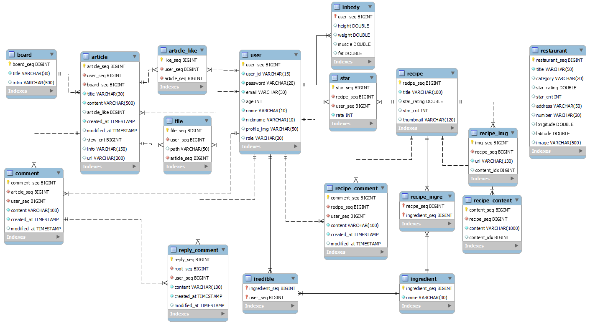

# README.md

## **AMUGEONA**

---

## 프로젝트 소개

🍳맛집 & 레시피 추천 어플🍽️

- 요리에 대한 사람들의 관심이 늘어남에 따라 레시피 어플에 대한 관심도 증가
- 다양한 레시피 어플에서 재료를 필터링 해주는 어플이 없어 이를 해결해 보고자 프로젝트를 진행하게 되었습니다.

---

## 기술 스택

---

- Java 11
- Spring Boot 2.7.6
- Spring Security
- JWT
- Spring data JPA
- Querydsl
- Spring cloud aws

---

## 🍴기능 설명

---

### 로그인 / 회원가입

    
    

- 로그인
    - Spring Security의 JwtAuthenticationFilter를 통해 로그인을 진행
    - 성공적으로 진행됐으면 successfulAuthentication 메서드를 통해 JWT토큰 발행
    - 이후 Role이 필요한 요청이 생기면 JwtAuthorizationFilter를 통해 인증을 진행하고 SecurityConfig에서 인가를 진행
    - Token 유효기간 경과 시 JwtExceptionFilter를 통해 UnAuthorized(401) 에러 전송
- 회원가입
    - 유저 가입 요청이 들어오면 ROLE_USER 권한 부여

### 레시피

    
    
    

- Recipe 목록
    - ‘만 개의 레시피’ 크롤링을 통해 약 1000개의 레시피 정보 DB 저장
    - 사용자가 등록한 못 먹는 음식을 제외하여 레시피들의 목록을 보여 줌
    - 무한 스크롤이 아닌 페이징 기능으로 목록을 보여 줌
- Recipe 검색 서비스
    - 재료를 검색 시 해당 재료를 가지고 만들 수 있는 레시피 목록을 보여줌
    - 사용자가 못 먹는 재료가 있다면, 해당 재료를 제외한 레시피 추천
- Recipe 별점 구현
    - 별점 등록, 수정, 삭제 구현
    - 한 유저당 하나의 별점만 작성할 수 있음

### 지도

    

- 위치 기반 서비스를 통해 주변 음식점 조회 기능
    - 현재 위치에서 위도 경도의 범위를 조절하여 주변 음식점 정보 조회 가능
    - 검색 기능으로 해당 위치 주변 음식점 정보 조회 가능
    - 이후 프론트에서 거리 순, 별점 순으로 정렬 가능
- 카카오 지도 크롤링을 통해 약 40만개의 음식점 정보 DB저장
    - 이후 프론트에서 네이버 검색API를 활용하여, 이미지 정보가 없을 시 검색 후 DB 저장

### 커뮤니티

    
    
    

- 게시판 CRUD
    - 게시물 조회, 게시글 작성, 게시글 수정, 게시글 삭제
- 게시물 사진 첨부
    - AWS S3와 연결
- 댓글 CRUD
    - 댓글 작성, 댓글 조회, 댓글 수정, 댓글 삭제
- 대댓글 기능
- 게시글 좋아요 기능
    - 좋아요를 누른 게시글을 다시 눌렀을 경우 좋아요 취소가 됨

### 마이페이지

    

- 인바디
- 못 먹는 재료
    - 각 유저 별로 저장해서 레시피 검색 시 해당 재료가 있는 레시피는 검색 대상에서 제외
- 프로필 사진 업로드
    - 게시글, 댓글에서 해당 유저의 프로필 사진을 보여줄 수 있음

---

## 🖥️aws 아키텍처

    

---

## 🖥️ERD

    

